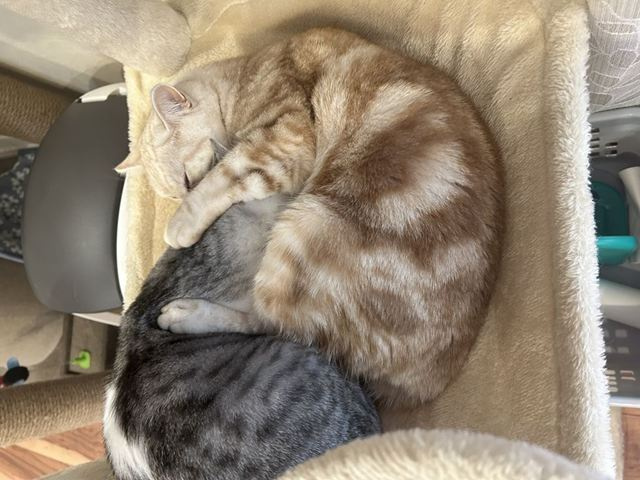
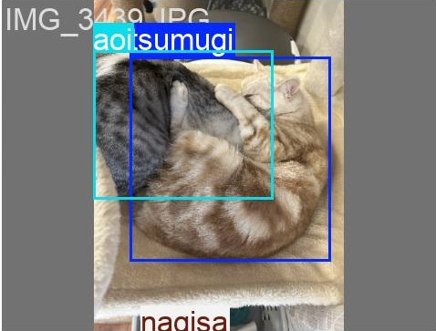

# Cat YOLO Detector 🐾

## Overview
愛猫3匹を個別に識別するための物体検出システムです。
YOLOv8をベースに、自作データセットを用いてファインチューニングを行いました。
「スマホからパソコンに写真を入れた際、猫ごとにフォルダを作り振り分けたい」と考え製作しました。

---

## Sample Results
学習済みのモデルを用いて、テスト用の画像に対して推論を行った結果です。

| Input Image | Detection Result |
|:---:|:---:|
|  |  |

> **Point:** 背景や体毛が似た色の子でも、顔の特徴や体格の差などを学習させることで、高い精度で識別が可能になりました。
> また、1匹ずつだけではなく、それぞれ2匹ずつが写っている場合や3匹写っている場合でも振り分けられるようにしました。

---

## Features
- **Custom YOLOv8 Training**: 独自の猫データセットによる個体識別。
- **Label Verification Tool**: アノテーションのズレを視覚的に確認する `train_label_confirmation.py` を実装。
- **Modular Config**: `cat_config.yaml` による柔軟な学習環境設定。

---

## Motivation (開発の経緯)
自分は3匹の猫と暮らしておりますが、最近のスマホは3匹の名前を設定するだけでだいたいラベリングされ、個々で写真を確認する事が出来ます。
しかし、写真をパソコン内に保存してしまうとラベリングデータはなく、撮影日時順や名前順などでソートするぐらいしか出来ません。
そこで、パソコンに写真を入れた際でも猫ごとに、それぞれのフォルダに振り分け保存したいと考え製作しました。
データの収集からアノテーション、モデルの評価までを一貫して行うことで、物体検出のパイプラインを深く理解することを目指しました。
今後は振り分けたフォルダごとで、自動で動画やスライドショーを作成するアプリケーションを作りたいと考えております。

---

## Tech Stack
- Python 3.9+
- Ultralytics (YOLOv8)
- OpenCV (Visualization)

---

## Project Structure
(以前の構成に `best.pt` などを追加して記載)

---

## How to Run
1. **Environment Setup**:
   ```bash
   pip install -r requirements.txt
